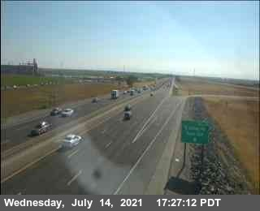
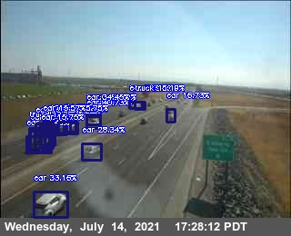
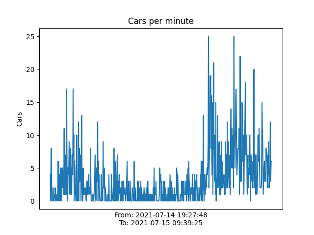
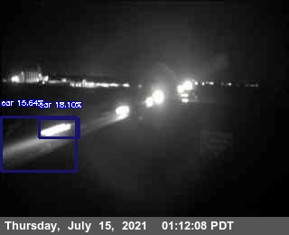

## Highway Traffic Detection
This is the final project for my STAT196K class. The requirements are to use one of the technologies we learned during this semester, I am choosing to use AWS, although will probably also be using SQL, large datasets, and complex datasets.

## Goals
I want to be able to use the ImageAI package in Python to be able to determine the amount of cars in CalTrans live cameras. Using this data I should be able to show current levels of traffic congestion at these locations. This data should be stored so that longer term analysis can be done to determine traffic levels based on time.

## Resources
### Object detection
https://imageai.readthedocs.io/en/latest/video/index.html
### CalTrans Cameras
[Web page](https://cwwp2.dot.ca.gov/vm/iframemap.htm)

[Free data (Low resolution)](https://cwwp2.dot.ca.gov/documentation/cctv/cctv.htm)

[Web Portal](https://cwwp2.dot.ca.gov/8ac11350-8006-4b32-b3d4-efab56b33cf8)
### SQL server
[My SQL tutorial](https://aws.amazon.com/getting-started/hands-on/create-microsoft-sql-db/)

## Outcomes
The images from CalTrans are collected once a minute and are 320 x 260. This is the largest bottleneck to the project going forward, although there may be solutions that need further investigation. These images are then processed by a pretrained Resnet model as seen below.

### Unprocessed:



The images captured by
### Processed:



These images were processed using a ```minimum_probibility = 15``` as seen in /src/vardata.py.

Here is an plot that shows detected vehicles over the course of a day. We do see a large increase during the morning commute time, however, this may be due to the issue described below.



## Problems
Recognizing vehicles at night, while it can be done, does seem to be returning inconsistant results. A great fix for this would be to train a custom model to look for moving lights, which since these cameras are limited to highways finding moving lights may be fairly accurate to determine whether a car is present.


